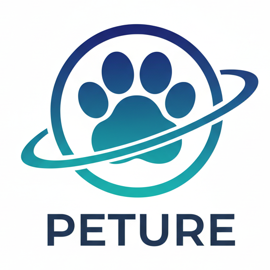

# 智宠合生 Peture 官方网站

<p align="center">
  
</p>

<p align="center">
  <strong>无限延伸人类的认知边界，让全球每一个人，因我们的存在，有更美好的生活</strong>
</p>

<p align="center">
  <a href="https://peture.com">官方网站</a> •
  <a href="https://github.com/PetureZCHS/Peture_Website">GitHub</a>
</p>

---

## 🚀 项目简介

智宠合生 Peture 官方网站，基于 Next.js 14 构建的现代化静态网站，展示 AI 驱动的宠物服务平台。

### 核心价值观
- **以人为本** - 回归人的真实需求，技术服务于人
- **去幻求真** - 穿透表象迷雾，直达问题本质  
- **知行合一** - 认知与行动合一，从洞察到实现

---

## 📁 项目结构

```
Peture_Website/
├── src/
│   ├── app/                    # Next.js App Router 页面
│   │   ├── page.tsx           # 首页
│   │   ├── about/page.tsx     # 关于我们
│   │   ├── ai-lab/page.tsx    # AI 生图实验室
│   │   ├── contact/page.tsx   # 联系页面
│   │   ├── features/page.tsx  # 功能介绍
│   │   ├── pricing/page.tsx   # 定价方案
│   │   ├── privacy/page.tsx   # 隐私政策
│   │   └── terms/page.tsx     # 服务条款
│   ├── components/
│   │   ├── ui/                # 基础 UI 组件
│   │   ├── layout/            # 布局组件
│   │   ├── animated/          # 动画组件
│   │   └── seo/               # SEO 组件
│   └── lib/                   # 工具函数
├── public/
│   └── images/                # 图片资源
│       └── ai-presets/        # AI 生图风格预设
└── AGENTS.md                  # 项目长期记忆文档
```

---

## 🛠️ 技术栈

- **框架**: [Next.js 14](https://nextjs.org/) (App Router)
- **语言**: [TypeScript](https://www.typescriptlang.org/)
- **样式**: [Tailwind CSS](https://tailwindcss.com/)
- **动画**: [Framer Motion](https://www.framer.com/motion/)
- **图标**: [Lucide React](https://lucide.dev/)
- **字体**: Fredoka + Nunito

---

## 🚀 快速开始

### 环境要求
- Node.js 18+
- npm / yarn / pnpm

### 安装依赖

```bash
npm install
```

### 启动开发服务器

```bash
npm run dev
```

在浏览器中打开 [http://localhost:3000](http://localhost:3000) 查看结果。

### 构建生产版本

```bash
npm run build
```

---

## 📱 页面说明

| 页面 | 路径 | 说明 |
|------|------|------|
| 首页 | `/` | 产品介绍、功能展示、下载入口 |
| 功能 | `/features` | 详细功能介绍 |
| AI 实验室 | `/ai-lab` | AI 生图功能展示，包含头像风格和壁纸风格 |
| 定价 | `/pricing` | 免费版、专业版、家庭版定价方案 |
| 关于我们 | `/about` | 公司使命、愿景、价值观、团队介绍 |
| 联系我们 | `/contact` | 联系方式和反馈表单 |

---

## 🎨 AI 生图风格预设

项目包含以下 AI 生图风格预设：

### 头像风格 (1:1)
- 3D 可爱、卡通治愈、水墨风格、赛博朋克、胶片复古
- 扁平极简、日系治愈、油画艺术、Q 版萌系、水彩治愈

### 手机壁纸 (9:16)
- 秋日风格、市集、牛仔、探险家、格子风格、奔跑

### 电脑壁纸 (16:9)
- 3D 空间、赛博城市、日系森林、油画风景
- 春日花海、星空治愈、温暖日落、窗光

---

## 📋 开发规范

详细规范请查看 [AGENTS.md](./AGENTS.md)，包含：

- 代码规范 (TypeScript/React)
- 样式与 UI 规范
- 排版规范（中英文混排必须添加空格）
- SEO 规范
- 项目结构说明

---

## 🔒 隐私与条款

- [隐私政策](./src/app/privacy/page.tsx)
- [服务条款](./src/app/terms/page.tsx)

---

## 📞 联系我们

- **邮箱**: peture_app@outlook.com
- **总部**: 中国 · 合肥

---

## 📄 许可证

© 2026 Peture. 保留所有权利。

---

<p align="center">
  <sub>用 AI 技术为您的宠物提供个性化服务，打造全方位智慧养宠体验</sub>
</p>
